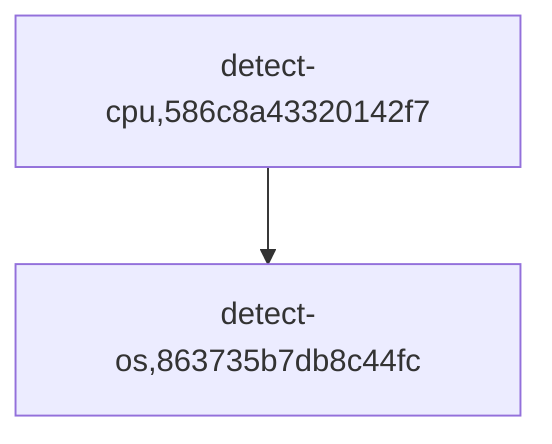

### About

This is a source code of portable and reusable automation recipes 
from MLCommons projects with a [human-friendly CM interface](https://github.com/mlcommons/ck) -
you can find a human-readable catalog of these automation recipes [here](../../docs/list_of_scripts.md).

### License

[Apache 2.0](../../LICENSE.md)

### Copyright

2022-2024 [MLCommons](https://mlcommons.org)
